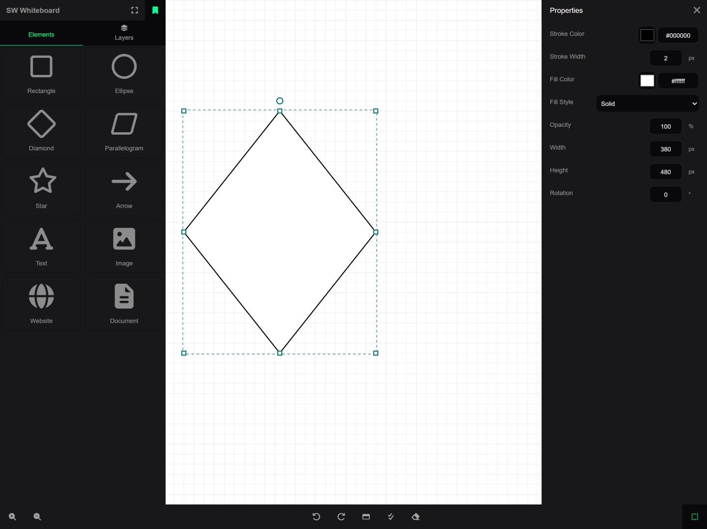
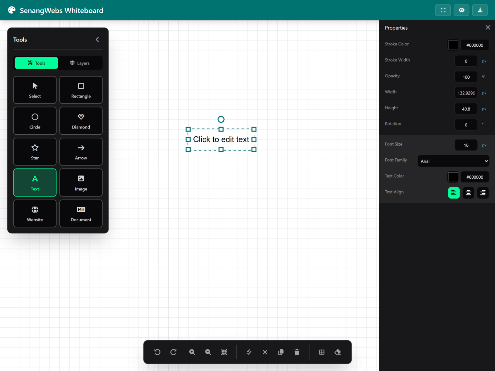

# SenangWebs Whiteboard (SWW)

A powerful, client-side JavaScript drawing library for creating interactive digital whiteboards and vector drawings with advanced performance optimizations and modern UI components.


| Preview                                   | Examples          |
| ------------------------------------------- | ------------------- |
|  | sww.html          |
|  | sww-tailwind.html |

## Features

### Drawing Tools

- **Basic Shapes**: Rectangle, Ellipse, Diamond, Parallelogram, Star
- **Lines & Arrows**: Directional arrows with customizable arrowheads
- **Text Elements**: Rich text with customizable fonts, sizes, colors, and alignment
- **Media Elements**: Embed websites, images, and markdown documents with live preview
- **Free Drawing**: Pen tool for freehand sketching with path optimization

### Advanced Capabilities

- **Layer Management**: Full layer control with visibility, locking, ordering, selection, and programmatic access
- **Element Management API**: Direct element manipulation with `getElementById()`, `selectElementById()`, `deleteElementById()`, and `toggleElementVisibility()`
- **Selection Tools**: Multi-select, selection boxes, bulk operations, group management, and smart selection
- **Undo/Redo System**: Complete history management with 50-step history and keyboard shortcuts
- **Performance Optimized**: Spatial indexing, Level of Detail (LOD), and optimized rendering for handling thousands of elements
- **Dark Theme Support**: Built-in dark mode with customizable color palettes and modern UI aesthetics
- **Export Options**: SVG and PNG export functionality with high-quality output
- **Grid System**: Snap-to-grid functionality with customizable grid sizes and visual toggle
- **Zoom Controls**: Smooth zooming (10% increments), panning, fit-to-elements, and 1:1 reset functionality
- **Clipboard Operations**: Copy, paste, duplicate, and cross-session clipboard support with keyboard shortcuts
- **Preview Mode**: Enhanced fullscreen presentation mode with dark background and locked editing
- **Read-Only Mode**: Presentation mode with completely locked editing capabilities and automatic preview activation

### Styling & Customization

- **Fill Styles**: Solid colors, gradients (linear/radial), hatch patterns, and transparency
- **Stroke Customization**: Color, width, and style options
- **Gradient Editor**: Multi-stop gradient creation with color and position controls
- **Element Properties**: Real-time property editing with instant feedback
- **Rotation & Resize**: Visual handles for element transformation
- **Font Management**: Multiple font families with size and alignment controls

### User Interface

- **Control Panel**: Organized tool selection and layer management with expand/dock options and tabbed interface
- **Modern Dark Theme**: Professional dark UI with accent colors (#00FF99 primary, #007370 secondary) and smooth transitions
- **Properties Panel**: Real-time property editing for selected elements with instant visual feedback
- **Context Menus**: Right-click operations for quick actions and element manipulation
- **Keyboard Shortcuts**: Standard shortcuts for common operations (Ctrl+Z/Y, Ctrl+A/C/V, Delete, Arrow keys)
- **Responsive Design**: Works seamlessly on desktop and tablet devices with touch support
- **Enhanced Preview Mode**: Fullscreen presentation mode with ESC key support and dark background
- **Floating Tool Palette**: Minimizable and repositionable tool palette with tab organization
- **Smart UI Hiding**: All editor UI elements automatically hide in preview mode for distraction-free presentation

### Markdown Support

- **Comprehensive Parser**: Full markdown specification support
- **Rich Formatting**: Headers (H1-H6), emphasis, lists, tables, code blocks
- **Advanced Features**: Blockquotes (nested), footnotes, task lists, definition lists
- **Media Support**: Images, links with titles, automatic link detection
- **Special Syntax**: Strikethrough, highlighting, emoji shortcodes
- **Live Editing**: Real-time markdown rendering with edit/preview toggle

## Installation

### Production Use (Recommended)

Simply include the built SWW files in your HTML - FontAwesome and Marked are pre-bundled:

```html
<!DOCTYPE html>
<html>
<head>
    <link rel="stylesheet" href="sww.css" />
    <script src="sww.js"></script>
</head>
<body>
    <div id="drawing-container"></div>
  
    <script>
        const container = document.getElementById('drawing-container');
        const whiteboard = sww.init(container, {
            backgroundColor: "#ffffff",
            gridSize: 20,
            showGrid: true
        });
    </script>
</body>
</html>
```

### Development Setup

For development or customization, you'll need to build the library from source:

```bash
# Clone the repository
git clone https://github.com/a-hakim/senangwebs-whiteboard.git
cd senangwebs-whiteboard

# Install dependencies
npm install

# Build for production
npm run build

# Or build with watch mode for development
npm run dev
```

### Dependencies

The library includes these dependencies that are bundled during the build process:

- **@fortawesome/fontawesome-free** (^6.4.0) - Icon library for UI elements
- **marked** (^9.0.0) - Markdown parser for document elements

### Build Output

After running `npm run build`, you'll find in the `dist/` folder:

- `sww.js` (150 KB) - Main library bundle with all dependencies and latest features
- `sww.css` (135 KB) - Stylesheet including FontAwesome icons and dark theme support
- `fonts/` - FontAwesome font files (232 KB total)
- `styles.js` - Additional style utilities for theme management

## Quick Start

### Basic Initialization

```javascript
// Initialize SWW in a container element
const container = document.getElementById('my-container');
const swwInstance = sww.init(container, {
    backgroundColor: "#ffffff",
    gridSize: 20,
    showGrid: true
});
```

### Setting Drawing Tools

```javascript
// Set the current drawing tool
swwInstance.setTool('rectangle');  // Draw rectangles
swwInstance.setTool('ellipse');    // Draw circles/ellipses
swwInstance.setTool('text');       // Add text
swwInstance.setTool('arrow');      // Draw arrows
swwInstance.setTool('select');     // Selection/manipulation tool
```

### Managing Elements

```javascript
// Select all elements
swwInstance.selectAll();

// Get specific element
const element = swwInstance.getElementById('element-id');

// Select specific element
swwInstance.selectElementById('element-id');

// Toggle element visibility
swwInstance.toggleElementVisibility('element-id');

// Delete specific element
swwInstance.deleteElementById('element-id');

// Clear the canvas
swwInstance.clearAll();
```

### Working with Scenes

```javascript
// Get current scene data
const sceneData = swwInstance.getScene();
console.log(`Scene has ${sceneData.elements.length} elements`);

// Save to localStorage
localStorage.setItem('my-drawing', JSON.stringify(sceneData));

// Load scene data
const savedData = JSON.parse(localStorage.getItem('my-drawing'));
swwInstance.loadScene(savedData);
```

### Zoom and Navigation

```javascript
// Zoom controls
swwInstance.zoomIn();      // Zoom in 10%
swwInstance.zoomOut();     // Zoom out 10%
swwInstance.resetZoom();   // Reset to 100%

// Fit all elements in view
swwInstance.fitCanvasToElements();

// Toggle grid
swwInstance.toggleGrid();
```

## Configuration Options

All configuration options are optional and have sensible defaults:

```javascript
const options = {
    // Canvas Dimensions
    width: "100%",                // Canvas width (CSS value or pixel number)
    height: "100%",               // Canvas height (CSS value or pixel number)
    
    // Visual Settings
    backgroundColor: "#ffffff",   // Canvas background color (hex, rgb, rgba)
    gridSize: 20,                 // Grid cell size in pixels (default: 20)
    showGrid: true,               // Show/hide grid on initialization (default: true)
    
    // Interaction Settings
    readOnly: false,              // Enable read-only mode (locks editing, auto-enters preview, disables ESC)
    
    // Performance Optimization (automatically managed, but configurable)
    performanceMode: false,       // Enable all performance optimizations (auto-enabled for large scenes)
    enableSpatialIndex: true,     // Use spatial indexing for efficient hit testing (auto-enabled at 100+ elements)
    lodThreshold: 100,            // Element count threshold to trigger Level of Detail rendering
    maxHistorySize: 50            // Maximum undo/redo history steps (default: 50, reduced to 20 for 500+ elements)
};

const swwInstance = sww.init(container, options);
```

### Configuration Details

#### Read-Only Mode
When `readOnly: true` is set:
- Application automatically enters preview mode on initialization
- Escape key is disabled (cannot exit preview mode)
- All editing functionality is completely locked
- UI elements are hidden for distraction-free viewing
- Perfect for presentations, embedded displays, kiosks, or read-only viewers

#### Performance Optimizations
The library automatically enables optimizations based on scene complexity:
- **Spatial Indexing**: Automatically enabled when scene has 100+ elements for O(1) hit testing
- **Level of Detail (LOD)**: Reduces rendering complexity for distant/small elements at zoom levels
- **Viewport Culling**: Only renders elements visible in current viewport for scenes with 100+ elements
- **Optimized Rendering**: Throttled updates during interactions for smooth 60fps performance

You can manually trigger optimizations:
```javascript
swwInstance.performOptimizedRender();     // Trigger optimized render cycle
swwInstance.rebuildSpatialIndex();        // Rebuild spatial index after bulk operations
swwInstance.updateVisibleElements();      // Update viewport culling
```

### Read-Only Mode

When `readOnly: true` is set:

- Application automatically enters preview mode on initialization
- Escape key is disabled (cannot exit preview mode)
- All editing functionality is completely locked
- Perfect for presentations, embedded displays, kiosks, or read-only viewers
- UI elements (toolbars, panels) are hidden to provide distraction-free viewing experience

```javascript
// Example: Read-only presentation mode
const swwInstance = sww.init(container, {
    readOnly: true,
    showGrid: false,
    backgroundColor: "#ffffff"
});

// Load presentation data
swwInstance.loadScene(presentationData);
```

## Drawing Tools

### Shape Tools

- `rectangle` - Draw rectangles and squares with customizable borders and fills
- `ellipse` - Draw circles and ellipses with gradient support
- `diamond` - Draw diamond shapes with rotation capabilities
- `parallelogram` - Draw parallelograms with skew transformations
- `star` - Draw 5-pointed star shapes with inner/outer radius control
- `arrow` - Draw directional arrows with customizable arrowheads

### Content Tools

- `text` - Add text elements with font customization, color, and alignment
  - **Available Fonts**: Arial, Helvetica, Times New Roman, Georgia, Verdana, Courier New, Monaco, Comic Sans MS, Impact, Trebuchet MS
- `website` - Embed website previews with URL configuration
- `image` - Add image elements with source URL and alt text support
- `markdown` - Add markdown documents with comprehensive syntax support

### Utility Tools

- `select` - Selection and manipulation tool with multi-select capabilities
- `draw` - Freehand drawing tool with path optimization

### Tool Settings

All tools support these customizable properties:

- **Stroke**: Color, width, and style
- **Fill**: Solid colors, gradients (linear/radial), hatch patterns, transparency
- **Opacity**: Element transparency (0-1)
- **Text**: Font family (10 choices), size, color, alignment
- **Gradients**: Multi-stop gradients with color and position controls
- **Grid Snapping**: Optional snap-to-grid with customizable grid size

## API Reference

### Core Initialization

#### `sww.init(container, options)`

Initializes a new SWW instance in the specified container.

**Parameters:**
- `container` (HTMLElement) - Required. The DOM element to initialize SWW in
- `options` (Object) - Optional. Configuration options (see Configuration section)

**Returns:** SWWInstance object

```javascript
const instance = sww.init(document.getElementById('container'), {
    backgroundColor: "#ffffff",
    gridSize: 20,
    showGrid: true
});
```

### Drawing Tool Methods

#### `setTool(toolName)`

Sets the current drawing tool.

**Parameters:**
- `toolName` (string) - Tool name: 'select', 'rectangle', 'ellipse', 'diamond', 'parallelogram', 'star', 'arrow', 'text', 'draw', 'website', 'image', 'markdown'

```javascript
instance.setTool('rectangle');
instance.setTool('text');
instance.setTool('select');
```

### Scene Management Methods

#### `getScene()`

Returns the current scene data as a JSON-serializable object.

**Returns:** Object containing:
- `elements` (Array) - All scene elements with their properties
- `viewBox` (Object) - Current viewport position and dimensions
- `zoom` (Number) - Current zoom level

```javascript
const sceneData = instance.getScene();
console.log(`Scene has ${sceneData.elements.length} elements`);
localStorage.setItem('my-drawing', JSON.stringify(sceneData));
```

#### `loadScene(sceneData)`

Loads a scene from JSON data. Clears current scene and replaces with loaded data.

**Parameters:**
- `sceneData` (Object) - Scene data object (from `getScene()`)

```javascript
const savedData = JSON.parse(localStorage.getItem('my-drawing'));
instance.loadScene(savedData);
```

#### `clearAll()`

Clears all elements from the canvas. Creates undo history entry.

```javascript
instance.clearAll();
```

### Element Management Methods

#### `getElementById(elementId)`

Finds and returns an element by its unique ID.

**Parameters:**
- `elementId` (string) - The unique element ID

**Returns:** Element object or `null` if not found

```javascript
const element = instance.getElementById('my-element-id');
if (element) {
    console.log('Element found:', element.type, element.x, element.y);
}
```

#### `selectElementById(elementId)`

Selects a specific element by its ID, clearing any previous selection.

**Parameters:**
- `elementId` (string) - The unique element ID

**Returns:** `true` if element found and selected, `false` otherwise

```javascript
const success = instance.selectElementById('my-element-id');
if (success) {
    console.log('Element selected');
}
```

#### `deleteElementById(elementId)`

Deletes a specific element by its ID. Creates undo history entry.

**Parameters:**
- `elementId` (string) - The unique element ID

**Returns:** `true` if element found and deleted, `false` otherwise

```javascript
const success = instance.deleteElementById('my-element-id');
console.log('Element deleted:', success);
```

#### `toggleElementVisibility(elementId)`

Toggles the visibility of an element by its ID.

**Parameters:**
- `elementId` (string) - The unique element ID

**Returns:** `true` if element found and toggled, `false` otherwise

```javascript
// Hide or show an element
const success = instance.toggleElementVisibility('my-element-id');
console.log('Visibility toggled:', success);
```

#### `generateId()`

Generates a unique ID for new elements. IDs are in format: `sww-<random>`

**Returns:** String - Unique element ID

```javascript
const newId = instance.generateId();
console.log('New ID:', newId); // e.g., 'sww-abc123def'
```

### Selection Methods

#### `selectAll()`

Selects all elements in the scene.

```javascript
instance.selectAll();
```

#### `clearSelection()`

Clears the current selection.

```javascript
instance.clearSelection();
```

#### `deleteSelectedElements()`

Deletes all currently selected elements. Creates undo history entry.

```javascript
instance.deleteSelectedElements();
```

#### `copySelected()`

Copies selected elements to internal clipboard.

```javascript
instance.copySelected();
```

#### `pasteClipboard()`

Pastes clipboard contents to canvas with offset positioning.

```javascript
instance.pasteClipboard();
```

#### `moveSelectedElements(direction, isShiftPressed)`

Moves selected elements using arrow keys with optional grid snapping.

**Parameters:**
- `direction` (string) - Direction: 'ArrowUp', 'ArrowDown', 'ArrowLeft', 'ArrowRight'
- `isShiftPressed` (boolean) - If true, moves by grid size; if false, moves by 1px

```javascript
// Move selected elements 1px left
instance.moveSelectedElements('ArrowLeft', false);

// Move selected elements by grid size up
instance.moveSelectedElements('ArrowUp', true);
```

### Zoom and View Methods

#### `zoomIn()` 

Zoom in by 10% increment (1.1x factor). Maximum zoom: 5x.

```javascript
instance.zoomIn();
```

#### `zoomOut()`

Zoom out by 10% increment (0.9x factor). Minimum zoom: 0.1x.

```javascript
instance.zoomOut();
```

#### `resetZoom()`

Reset zoom to 100% (1:1 ratio) and reset viewBox to default.

```javascript
instance.resetZoom();
```

#### `fitCanvasToElements()`

Automatically adjust viewport to show all visible elements with padding.

```javascript
instance.fitCanvasToElements();
```

#### `toggleGrid()`

Toggle grid visibility and snap-to-grid functionality together.

**Returns:** boolean - Current grid visibility state

```javascript
const isGridVisible = instance.toggleGrid();
console.log('Grid is now:', isGridVisible ? 'visible' : 'hidden');
```

### Layer Management Methods

#### `bringSelectedToFront()`

Brings selected elements to the front of the drawing order.

```javascript
instance.bringSelectedToFront();
```

#### `sendSelectedToBack()`

Sends selected elements to the back of the drawing order.

```javascript
instance.sendSelectedToBack();
```

#### `groupSelected()`

Groups selected elements together. Requires at least 2 selected elements.

```javascript
instance.groupSelected();
```

#### `ungroupSelected()`

Ungroups selected elements.

```javascript
instance.ungroupSelected();
```

#### `lockSelected()` / `unlockSelected()`

Lock or unlock selected elements to prevent editing.

```javascript
instance.lockSelected();
instance.unlockSelected();
```

#### `toggleLockSelected()`

Toggle lock state of selected elements.

```javascript
instance.toggleLockSelected();
```

### Performance and Optimization Methods

#### `performOptimizedRender()`

Triggers an optimized rendering update for better performance. Useful after bulk operations.

```javascript
// After adding multiple elements
for (let i = 0; i < 100; i++) {
    instance.addElement(createMyElement(i));
}
instance.performOptimizedRender();
```

#### `rebuildSpatialIndex()`

Rebuilds the spatial index for improved hit testing performance. Call after bulk element modifications.

```javascript
// After modifying many elements
instance.rebuildSpatialIndex();
```

#### `updateElementInSpatialIndex(element)`

Updates a specific element's position in the spatial index after modification.

**Parameters:**
- `element` (Object) - The element that was modified

```javascript
const element = instance.getElementById('my-element');
element.x = 100;
element.y = 200;
instance.updateElementInSpatialIndex(element);
```

#### `getLevelOfDetail(element)`

Returns the appropriate level of detail for an element based on current zoom level and element size.

**Parameters:**
- `element` (Object) - The element to check

**Returns:** string - 'high', 'medium', or 'low'

```javascript
const lod = instance.getLevelOfDetail(element);
console.log('Element LOD:', lod);
```

#### `updateVisibleElements()`

Updates which elements are visible in the current viewport. Automatically called for scenes with 100+ elements.

```javascript
instance.updateVisibleElements();
```

### Preview Mode Methods

#### `togglePreviewMode()`

Toggle between edit and preview modes. In preview mode, UI elements are hidden and editing is locked.

```javascript
instance.togglePreviewMode();
```

#### `enterPreviewMode()`

Enter fullscreen preview mode with dark background and hidden UI elements.

```javascript
instance.enterPreviewMode();
```

#### `exitPreviewMode()`

Exit preview mode and return to editing. Disabled when `readOnly: true` is set.

```javascript
instance.exitPreviewMode();
```

### History Methods

#### `undo()`

Undo the last action. Maximum 50 history steps (20 for large scenes with 500+ elements).

```javascript
instance.undo();
```

#### `redo()`

Redo the previously undone action.

```javascript
instance.redo();
```

### Export Methods

#### `exportToSVG()`

Export the current scene as SVG format. Downloads automatically.

**Returns:** string - SVG data

```javascript
const svgData = instance.exportToSVG();
// SVG file is automatically downloaded
```

#### `exportToPNG()`

Export the current scene as PNG format. Downloads automatically.

```javascript
instance.exportToPNG();
// PNG file is automatically downloaded
```

### Element Property Update Methods

#### `updateSelectedElementProperty(property, value)`

Update a specific property for all selected elements with undo support.

**Parameters:**
- `property` (string) - Property name (e.g., 'fillColor', 'strokeWidth', 'opacity')
- `value` (any) - New property value

```javascript
// Change fill color of selected elements
instance.updateSelectedElementProperty('fillColor', '#ff0000');

// Change stroke width
instance.updateSelectedElementProperty('strokeWidth', 5);

// Change opacity
instance.updateSelectedElementProperty('opacity', 0.5);
```

#### `syncPropertiesPanel()`

Synchronize the properties panel with currently selected elements.

```javascript
instance.syncPropertiesPanel();
```

### Event Listeners

SWW dispatches custom events that you can listen to:

#### Scene Change Event

```javascript
container.addEventListener('sww:sceneChanged', (event) => {
    console.log('Scene updated:', event.detail);
});
```

#### Selection Change Event

```javascript
container.addEventListener('sww:selectionChanged', (event) => {
    console.log('Selection:', event.detail.selectedElements);
});
```

#### Preview Mode Events

```javascript
// Preview mode entered
container.addEventListener('previewModeEntered', (event) => {
    console.log('Entered preview mode');
});

// Preview mode exited
container.addEventListener('previewModeExited', (event) => {
    console.log('Exited preview mode');
});
```

## Control Panel Integration

SWW includes a comprehensive built-in control panel with modern dark theme support:

```javascript
// Initialize control panel with tabbed interface
const controlPanel = new SWWControlPanel(swwInstance);

// The control panel automatically handles:
// - Tool selection with visual feedback and hover effects
// - Layer management with drag-and-drop and bulk operations  
// - Element properties with real-time updates and live preview
// - Scene operations and export functions with keyboard shortcuts
// - Panel docking, width expansion, and responsive layout
// - Dark theme integration with accent colors and smooth transitions
```

### Control Panel Features

- **Modern Dark Theme**: Professional dark UI with #00FF99 primary and #007370 secondary accent colors
- **Tabbed Interface**: Organized tabs for Tools and Layers with smooth transitions
- **Tool Selection Grid**: Visual grid with FontAwesome icons, labels, and hover effects
- **Layer Management**: Advanced list view with visibility, lock, selection, and deletion controls
- **Properties Panel**: Real-time editing of selected element properties with instant feedback
- **Expandable Width**: Toggle between normal (280px) and expanded width for more workspace
- **Floating Design**: Minimizable and repositionable tool palette that doesn't interfere with canvas
- **Smart Hiding**: Automatically hides in preview mode for distraction-free presentation
- **Keyboard Integration**: Full keyboard shortcut support (1-5 for tools, Ctrl+Z/Y, etc.)

### Layer Management

```javascript
// Access through the control panel instance with enhanced functionality
const controlPanel = new SWWControlPanel(swwInstance);

// Advanced layer operations:
controlPanel.toggleLayerSelection('layer-id');    // Select/deselect layer with visual feedback
controlPanel.toggleLayerVisibility('layer-id');   // Show/hide layer with smooth transitions
controlPanel.toggleLayerLock('layer-id');         // Lock/unlock layer with status indicators
controlPanel.focusOnLayer('layer-id');            // Focus camera on layer with smooth zoom

// Direct element management:
swwInstance.getElementById('element-id');          // Find element by ID
swwInstance.selectElementById('element-id');       // Select specific element
swwInstance.deleteElementById('element-id');       // Delete specific element
swwInstance.toggleElementVisibility('element-id'); // Toggle element visibility

// Bulk operations with undo support:
swwInstance.selectAll();                           // Select all layers
swwInstance.clearSelection();                      // Clear selection
swwInstance.copySelected();                        // Copy selected with clipboard
swwInstance.pasteClipboard();                     // Paste clipboard with positioning
swwInstance.deleteSelectedElements();              // Delete selected with confirmation
```

## Markdown Support

SWW includes a comprehensive markdown parser that supports the full markdown specification:

### Basic Syntax

- **Headers**: `# H1` through `###### H6`
- **Emphasis**: `*italic*`, `**bold**`, `***bold italic***`
- **Strikethrough**: `~~strikethrough~~`
- **Highlighting**: `==highlighted text==`
- **Inline Code**: `` `code` ``

### Lists

- **Unordered**: `- item` or `* item` or `+ item`
- **Ordered**: `1. item`
- **Task Lists**: `- [ ] unchecked` and `- [x] checked`
- **Definition Lists**: `Term: Definition`

### Links & Images

- **Links**: `[text](https://github.com/a-hakim/senangwebs-whiteboard)` or `[text](https://github.com/a-hakim/senangwebs-whiteboard "title")`
- **Images**: `` or ``
- **Automatic Links**: `<https://example.com>`
- **Email Links**: `<email@example.com>`

### Code & Quotes

- **Code Blocks**: ``` or indented (4 spaces)
- **Language Syntax**: ```javascript
- **Blockquotes**: `> quote` (supports nesting with `>>`)

### Tables

```markdown
| Header 1 | Header 2 |
|----------|----------|
| Cell 1   | Cell 2   |
```

### Advanced Features

- **Horizontal Rules**: `---`, `***`, or `___`
- **Footnotes**: `[^1]` with `[^1]: definition`
- **Line Breaks**: Double space at end of line or double newline
- **Escaping**: `\` before special characters
- **Emoji**: `:smile:`, `:heart:`, `:thumbsup:` (basic set)

### Usage in SWW

```javascript
// Create markdown element
swwInstance.setTool('markdown');
// Click to place element, then double-click to edit

// Programmatic creation
const markdownElement = {
    type: "markdown",
    markdown: "# Hello World\n\nThis is **bold** text.",
    x: 100, y: 100, width: 300, height: 200
};
```

## Performance Features

SWW is designed to handle large scenes with thousands of elements efficiently. Performance optimizations are automatically enabled based on scene complexity.

### Spatial Indexing

For scenes with many elements, SWW uses advanced spatial indexing for ultra-efficient hit testing:

```javascript
// Automatically enabled for scenes with 100+ elements
// Provides O(1) average case hit testing performance
// Supports 10,000+ elements with smooth interaction

// Manual spatial index management
swwInstance.rebuildSpatialIndex();                 // Rebuild after bulk operations
swwInstance.updateElementInSpatialIndex(element);  // Update specific element position
```

**How it works:**
- Grid-based spatial partitioning divides canvas into cells
- Elements are indexed by their bounding box coverage
- Hit testing only checks elements in relevant cells
- Automatic rebuilding when needed

### Level of Detail (LOD)

Intelligent rendering optimization that reduces complexity for distant or small elements:

```javascript
// Automatically adjusts element detail based on zoom level
// Maintains 60fps performance with thousands of elements
// Three LOD levels: high, medium, low

const lod = swwInstance.getLevelOfDetail(element); // Get current LOD level
// Returns: 'high', 'medium', or 'low'
```

**LOD Levels:**
- **High Detail**: Full rendering with all visual features (close zoom, large elements)
- **Medium Detail**: Simplified rendering, reduced visual complexity (medium zoom)
- **Low Detail**: Minimal rendering, basic shapes only (far zoom, small elements)

### Viewport Culling

Only renders elements visible in the current viewport:

```javascript
// Automatically enabled for scenes with 100+ elements
// Updates visible element set on pan/zoom
// Significantly reduces rendering overhead

swwInstance.updateVisibleElements(); // Manually update visible set
```

### Optimized Rendering

```javascript
// Enable all performance features
const options = {
    performanceMode: true,        // Enable all optimizations (auto-managed)
    enableSpatialIndex: true,     // Enable spatial indexing (default: true)
    lodThreshold: 100,            // Start LOD at 100 elements (default)
    maxHistorySize: 50            // Undo history limit (default: 50, auto-reduces to 20 for 500+ elements)
};

const swwInstance = sww.init(container, options);

// Manual optimization triggers
swwInstance.performOptimizedRender();  // Trigger optimized render cycle
swwInstance.rebuildSpatialIndex();     // Rebuild spatial index after bulk changes
swwInstance.updateVisibleElements();   // Update viewport culling
```

### Performance Tips

1. **Bulk Operations**: Use `performOptimizedRender()` after adding/modifying many elements
2. **Spatial Index**: Call `rebuildSpatialIndex()` after major scene changes
3. **Element Limits**: Library efficiently handles 10,000+ elements with optimizations enabled
4. **History Management**: History automatically reduces for large scenes (20 steps for 500+ elements)
5. **Throttled Updates**: Real-time property updates are throttled to maintain 60fps

## Element Properties

### Common Properties

All elements support these properties:

```javascript
{
    id: "unique-id",              // Auto-generated unique identifier (sww-xxxxxxx)
    type: "rectangle",            // Element type: rectangle, ellipse, diamond, etc.
    x: 100,                       // X position in canvas coordinates
    y: 100,                       // Y position in canvas coordinates
    width: 200,                   // Element width in pixels
    height: 150,                  // Element height in pixels
    strokeColor: "#007bff",       // Border/outline color (hex, rgb, rgba)
    strokeWidth: 2,               // Border/outline width in pixels
    fillColor: "#e3f2fd",         // Fill color (hex, rgb, rgba, or 'transparent')
    fillStyle: "solid",           // Fill style: 'solid', 'gradient', 'hatch', 'transparent'
    gradientType: "linear",       // Gradient type: 'linear' or 'radial' (when fillStyle='gradient')
    gradientStops: [              // Gradient color stops (when fillStyle='gradient')
        { offset: 0, color: "#000000" },
        { offset: 100, color: "#ffffff" }
    ],
    opacity: 1.0,                 // Element opacity (0.0 to 1.0)
    rotation: 0,                  // Rotation in degrees (0-360)
    locked: false,                // Lock element to prevent editing
    visible: true,                // Element visibility (can be toggled)
    hidden: false,                // Alternative visibility flag
    groupId: null                 // Group identifier for grouped elements
}
```

### Type-Specific Properties

#### Text Elements
```javascript
{
    type: "text",
    text: "Sample text",          // Text content
    fontSize: 16,                 // Font size in pixels
    fontFamily: "Arial",          // Font family: Arial, Helvetica, Times New Roman, Georgia, Verdana, Courier New, Monaco, Comic Sans MS, Impact, Trebuchet MS
    textAlign: "left",            // Text alignment: left, center, right
    textColor: "#000000"          // Text color (separate from strokeColor)
}
```

#### Website Elements
```javascript
{
    type: "website", 
    url: "https://example.com",   // Website URL to embed
    text: "Website Title"         // Display text when URL is not set
}
```

#### Image Elements
```javascript
{
    type: "image",
    imageUrl: "image-url",        // Image source URL or data URI
    src: "image-url",             // Alternative property for image source
    alt: "Alt text",              // Alternative text for accessibility
    text: "Image placeholder"     // Placeholder text when image not loaded
}
```

#### Markdown Elements
```javascript
{
    type: "markdown",
    markdown: "# Title\n\nContent...",  // Raw markdown source
    text: "Rendered HTML content"       // Rendered HTML (auto-generated)
}
```

#### Line/Arrow Elements
```javascript
{
    type: "arrow",
    x: 100,                       // Start X coordinate
    y: 100,                       // Start Y coordinate
    width: 200,                   // End X offset
    height: 150,                  // End Y offset
    strokeColor: "#000000",       // Line color
    strokeWidth: 2                // Line width
}
```

#### Draw/Freehand Elements
```javascript
{
    type: "draw",
    points: [                     // Array of path points
        { x: 100, y: 100 },
        { x: 110, y: 105 },
        // ... more points
    ],
    strokeColor: "#000000",       // Path color
    strokeWidth: 2                // Path width
}
```

## Keyboard Shortcuts

### Basic Operations

- `Ctrl+Z` - Undo last action
- `Ctrl+Y` or `Ctrl+Shift+Z` - Redo last undone action
- `Ctrl+A` - Select all elements
- `Ctrl+C` - Copy selected elements to clipboard
- `Ctrl+V` - Paste clipboard contents
- `Delete` or `Backspace` - Delete selected elements
- `Escape` - Clear selection / Exit preview mode (unless `readOnly: true`)

### Navigation & Zoom

- `Ctrl + Mouse Wheel` - Zoom in/out (centered on mouse position)
- `+` or `=` - Zoom in by 10% when canvas focused
- `-` or `_` - Zoom out by 10% when canvas focused
- `0` - Reset zoom to 100% (1:1 ratio)
- `Space + Drag` or `Alt + Drag` - Pan/move viewport
- `Arrow Keys` - Move selected elements by 1 pixel (precise positioning)
- `Shift + Arrow Keys` - Move selected elements by grid size (grid-aligned movement)
- `H` - Fit canvas to show all elements with padding

### Tools & View

- `G` - Toggle grid visibility and snap-to-grid
- `P` - Toggle preview/presentation mode
- `1` - Select tool (selection/manipulation)
- `2` - Rectangle tool
- `3` - Ellipse/Circle tool
- `4` - Arrow tool
- `5` - Text tool
- `Alt+H` - Show keyboard shortcuts help dialog (if implemented)

### Element Manipulation

- `Double-click` - Edit text/markdown elements inline
- `Right-click` - Open context menu with element-specific actions
- `Drag` - Move selected elements with real-time feedback
- `Drag resize handles` - Resize elements (hold Shift to maintain aspect ratio)
- `Drag rotation handle` - Rotate elements (angles snap to 15° increments)
- `Ctrl + Drag` - Duplicate element while dragging

## Advanced Usage

### Custom Element Creation

```javascript
// Create custom element programmatically
const customElement = {
    id: swwInstance.generateId(),
    type: "rectangle",
    x: 100, 
    y: 100,
    width: 200, 
    height: 150,
    strokeColor: "#ff0000",
    strokeWidth: 2,
    fillColor: "#ffcccc",
    fillStyle: "gradient",
    gradientType: "linear",
    gradientStops: [
        { offset: 0, color: "#ff0000" },
        { offset: 100, color: "#ffcccc" }
    ],
    opacity: 1,
    rotation: 0
};

// Add to scene (Note: Direct manipulation - use with caution)
swwInstance.elements.push(customElement);
const svgElement = swwInstance.createSVGElement(customElement);
customElement.svgElement = svgElement;
swwInstance.addSVGElementToDOM(customElement);
swwInstance.updateSVGElement(customElement);
swwInstance.updateElementInSpatialIndex(customElement);
```

### Gradient Management

```javascript
// Create multi-stop gradient
const gradientStops = [
    { offset: 0, color: "#ff0000" },
    { offset: 50, color: "#00ff00" },
    { offset: 100, color: "#0000ff" }
];

// Apply to element
element.fillStyle = "gradient";
element.gradientType = "radial"; // or "linear"
element.gradientStops = gradientStops;
swwInstance.updateSVGElement(element);
```

### Event Handling

```javascript
// Listen for scene changes
container.addEventListener('sww:sceneChanged', (event) => {
    console.log('Scene updated:', event.detail);
    // Auto-save to localStorage
    localStorage.setItem('auto-save', JSON.stringify(swwInstance.getScene()));
});

// Listen for selection changes
container.addEventListener('sww:selectionChanged', (event) => {
    console.log('Selected elements:', event.detail.selectedElements);
    // Update custom UI based on selection
});

// Listen for preview mode changes
container.addEventListener('previewModeEntered', () => {
    console.log('Entered presentation mode');
    // Hide custom UI elements
});

container.addEventListener('previewModeExited', () => {
    console.log('Exited presentation mode');
    // Show custom UI elements
});
```

### Save/Load System

```javascript
// Save to localStorage with metadata
const sceneData = swwInstance.getScene();
const saveData = {
    version: "1.0.0",
    timestamp: Date.now(),
    elements: sceneData.elements,
    viewBox: sceneData.viewBox,
    zoom: sceneData.zoom,
    metadata: {
        title: "My Drawing",
        author: "User Name"
    }
};
localStorage.setItem('my-drawing', JSON.stringify(saveData));

// Load from localStorage
const savedData = JSON.parse(localStorage.getItem('my-drawing'));
if (savedData) {
    swwInstance.loadScene({
        elements: savedData.elements,
        viewBox: savedData.viewBox,
        zoom: savedData.zoom
    });
    console.log(`Loaded: ${savedData.metadata.title}`);
}

// Export to file
function downloadScene() {
    const sceneData = swwInstance.getScene();
    const json = JSON.stringify(sceneData, null, 2);
    const blob = new Blob([json], { type: 'application/json' });
    const url = URL.createObjectURL(blob);
    const link = document.createElement('a');
    link.href = url;
    link.download = 'drawing.sww.json';
    link.click();
    URL.revokeObjectURL(url);
}

// Import from file
function loadSceneFromFile(file) {
    const reader = new FileReader();
    reader.onload = (e) => {
        try {
            const sceneData = JSON.parse(e.target.result);
            swwInstance.loadScene(sceneData);
        } catch (error) {
            console.error('Failed to load scene:', error);
        }
    };
    reader.readAsText(file);
}
```

### Batch Element Operations

```javascript
// Batch add elements with optimization
const newElements = [];
for (let i = 0; i < 100; i++) {
    newElements.push({
        id: swwInstance.generateId(),
        type: "rectangle",
        x: Math.random() * 1000,
        y: Math.random() * 1000,
        width: 50,
        height: 50,
        strokeColor: "#000000",
        fillColor: `hsl(${Math.random() * 360}, 70%, 50%)`
    });
}

// Add all elements
newElements.forEach(element => {
    const svgElement = swwInstance.createSVGElement(element);
    element.svgElement = svgElement;
    swwInstance.elements.push(element);
    swwInstance.addSVGElementToDOM(element);
});

// Trigger optimized render after batch operation
swwInstance.rebuildSpatialIndex();
swwInstance.performOptimizedRender();
```

### Custom Property Updates

```javascript
// Update multiple properties at once
function updateElementProperties(elementId, properties) {
    const element = swwInstance.getElementById(elementId);
    if (!element) return false;
    
    // Update properties
    Object.assign(element, properties);
    
    // Update visual representation
    swwInstance.updateSVGElement(element);
    swwInstance.updateElementInSpatialIndex(element);
    
    return true;
}

// Usage
updateElementProperties('my-element-id', {
    x: 200,
    y: 300,
    width: 250,
    fillColor: '#ff6b6b',
    opacity: 0.8
});
```

### Performance Monitoring

```javascript
// Monitor scene complexity
function getSceneStats() {
    const scene = swwInstance.getScene();
    return {
        elementCount: scene.elements.length,
        selectedCount: swwInstance.selectedElements.size,
        zoom: scene.zoom,
        historySize: swwInstance.historyStack.length,
        spatialIndexEnabled: swwInstance.elements.length >= 100
    };
}

// Log performance metrics
console.log('Scene Stats:', getSceneStats());

// Optimize based on element count
const stats = getSceneStats();
if (stats.elementCount > 1000) {
    console.log('Large scene detected, optimizations active');
    swwInstance.performOptimizedRender();
}
```

## Styling and Themes

SWW features comprehensive theming support with CSS custom properties and built-in dark mode:

### Dark Theme Integration

```css
:root {
    /* Primary brand colors */
    --sww-primary-color: #00FF99;        /* Bright green accent */
    --sww-secondary-color: #007370;      /* Teal secondary */
  
    /* Dark theme palette */
    --sww-background-color: #18181B;      /* Light dark background */
    --sww-panel-background: #09090B;     /* Deep dark panels */
    --sww-text-color: #ffffff;           /* High contrast text */
    --sww-accent-color: #00FF99;         /* Interactive elements */
  
    /* State colors */
    --sww-hover-color: #00e689;          /* Hover states */
    --sww-border-color: #374151;         /* Subtle borders */
    --sww-success-color: #10b981;        /* Success feedback */
    --sww-warning-color: #f59e0b;        /* Warning states */
}
```

### Tailwind CSS Integration

The library works seamlessly with Tailwind CSS for rapid UI development:

```html
<!-- Modern dark theme with Tailwind classes -->
<div class="bg-dark-bg text-white border border-neutral-700">
    <button class="bg-primary-500 hover:bg-primary-600 text-dark-bg 
                   px-4 py-2 rounded-lg transition-all duration-200 
                   hover:-translate-y-0.5 glow-primary">
        Primary Action
    </button>
</div>
```

### Custom Theme Configuration

```javascript
// Configure Tailwind with SWW color palette
tailwind.config = {
    theme: {
        extend: {
            colors: {
                primary: {
                    500: '#00FF99',
                    600: '#00e689',
                    700: '#00cc7a'
                },
                secondary: {
                    500: '#007370',
                    600: '#006562'
                },
                dark: {
                    bg: '#18181B',
                    panel: '#09090B'
                }
            }
        }
    }
}
```

### Troubleshooting

**Issue: Elements not rendering**
- Ensure container has explicit width/height (not just auto)
- Check browser console for errors
- Verify sww.js and sww.css are loaded correctly

**Issue: Poor performance with many elements**
- Performance optimizations auto-enable at 100+ elements
- Manually call `performOptimizedRender()` after bulk operations
- Use `rebuildSpatialIndex()` after major scene changes

**Issue: Can't exit preview mode**
- Check if `readOnly: true` is set (disables ESC exit)
- Ensure no other event listeners are blocking ESC key

**Issue: Grid not showing**
- Verify `showGrid: true` in options
- Check if grid visibility was toggled with `toggleGrid()`
- Grid automatically syncs with snap-to-grid setting

**Issue: Undo/Redo not working**
- History is automatically saved for most operations
- Maximum 50 steps (20 for 500+ element scenes)
- Some direct element manipulations may bypass history

## Browser Support

SWW is built with modern web standards and supports all current browsers:

- ✅ **Chrome 80+** - Fully Supported
- ✅ **Firefox 75+** - Fully Supported
- ✅ **Safari 13+** - Fully Supported
- ✅ **Edge 80+** - Fully Supported
- ⚠️ **Internet Explorer** - Not Supported

**Requirements:**
- ES6+ JavaScript support
- SVG rendering support
- CSS Grid and Flexbox
- Modern event handling (pointer events)

## License

This project is licensed under the MIT License - see the [LICENSE.md](LICENSE.md) file for details.

## Contributing

Contributions are welcome! Please feel free to submit a Pull Request.

## Examples

### Complete HTML Example with Dark Theme

```html
<!DOCTYPE html>
<html lang="en">
<head>
    <meta charset="UTF-8">
    <meta name="viewport" content="width=device-width, initial-scale=1.0">
    <title>SWW Dark Theme App</title>
  
    <!-- Tailwind CSS with SWW theme configuration -->
    <script src="https://cdn.tailwindcss.com"></script>
    <script>
        tailwind.config = {
            theme: {
                extend: {
                    colors: {
                        primary: { 500: '#00FF99', 600: '#00e689', 700: '#00cc7a' },
                        secondary: { 500: '#007370', 600: '#006562', 700: '#005854' },
                        dark: { bg: '#18181B', panel: '#09090B' }
                    }
                }
            }
        }
    </script>
  
    <!-- SWW includes FontAwesome and Marked built-in -->
    <link rel="stylesheet" href="sww.css">
    <script src="sww.js"></script>
  
    <style>
        /* Dark theme enhancements */
        .preview-mode {
            background: #000 !important;
            cursor: pointer;
        }
        .preview-mode #sww-drawing-canvas {
            background: white;
            border-radius: 8px;
            box-shadow: 0 20px 25px -5px rgba(0, 255, 153, 0.1);
        }
        .glow-primary {
            box-shadow: 0 0 20px rgba(0, 255, 153, 0.3);
        }
    </style>
</head>
<body class="font-sans h-screen overflow-hidden bg-dark-bg">
    <!-- Dark themed header -->
    <header class="bg-secondary-500 text-white px-5 py-3 flex justify-between items-center shadow-lg z-50">
        <h1 class="text-xl font-semibold flex items-center gap-2.5">
            <i class="fas fa-palette"></i>
            SenangWebs Whiteboard
        </h1>
        <div class="flex gap-2">
            <button onclick="togglePreview()" 
                    class="bg-white/10 hover:bg-primary-500/20 border border-white/20 
                           hover:border-primary-500/50 text-white px-3 py-2 rounded-md 
                           transition-all duration-200 hover:-translate-y-0.5"
                    title="Preview Mode">
                <i class="fas fa-eye"></i>
            </button>
            <button onclick="exportCanvas()" 
                    class="bg-white/10 hover:bg-primary-500/20 border border-white/20 
                           hover:border-primary-500/50 text-white px-3 py-2 rounded-md 
                           transition-all duration-200 hover:-translate-y-0.5"
                    title="Export">
                <i class="fas fa-download"></i>
            </button>
        </div>
    </header>

    <!-- Main content with floating tool palette -->
    <div class="flex flex-1 relative bg-dark-panel">
        <!-- Floating Tool Palette -->
        <div id="toolPalette" class="absolute top-5 left-5 bg-dark-bg border border-neutral-700 
                                    rounded-xl shadow-2xl p-4 z-40 min-w-[280px] transition-all duration-300">
        
            <!-- Tool tabs -->
            <div class="flex mb-4 bg-dark-panel rounded-lg p-1">
                <button onclick="switchTab('tools')" 
                        class="flex-1 bg-primary-500 text-dark-bg px-3 py-2 rounded-md 
                               text-xs font-medium transition-all duration-200">
                    <i class="fas fa-tools"></i> Tools
                </button>
                <button onclick="switchTab('layers')" 
                        class="flex-1 bg-transparent text-neutral-400 px-3 py-2 rounded-md 
                               text-xs font-medium transition-all duration-200 hover:text-primary-500">
                    <i class="fas fa-layer-group"></i> Layers
                </button>
            </div>
        
            <!-- Tools grid with dark theme -->
            <div id="toolsGrid" class="grid grid-cols-2 gap-2">
                <button onclick="selectTool('select')" 
                        class="bg-primary-500/20 border-2 border-primary-500 text-primary-500 
                               p-3 rounded-lg transition-all duration-200 hover:-translate-y-0.5">
                    <i class="fas fa-mouse-pointer"></i><br>Select
                </button>
                <!-- Additional tool buttons... -->
            </div>
        </div>

        <!-- Canvas Area -->
        <div class="sww-canvas-area flex-1" id="whiteboard-container"></div>
    </div>
  
    <script>
        document.addEventListener('DOMContentLoaded', () => {
            const container = document.getElementById('whiteboard-container');
        
            // Initialize whiteboard with dark theme support
            const whiteboard = sww.init(container, {
                backgroundColor: "#ffffff",
                gridSize: 20,
                showGrid: true,
                readOnly: false,           // Set to true for presentation mode
                performanceMode: true,     // Enable performance optimizations
                enableSpatialIndex: true,  // Large scene support
                lodThreshold: 100          // LOD optimization threshold
            });
        
            // Initialize control panel with dark theme
            const controlPanel = new SWWControlPanel(whiteboard);
        
            // Enhanced keyboard shortcuts
            document.addEventListener('keydown', (e) => {
                if (e.target.tagName === 'INPUT' || e.target.tagName === 'TEXTAREA') return;
            
                if (e.ctrlKey || e.metaKey) {
                    switch (e.key) {
                        case 'z': e.preventDefault(); e.shiftKey ? whiteboard.redo() : whiteboard.undo(); break;
                        case 'y': e.preventDefault(); whiteboard.redo(); break;
                        case 'a': e.preventDefault(); whiteboard.selectAll(); break;
                        case 'c': e.preventDefault(); whiteboard.copySelected(); break;
                        case 'v': e.preventDefault(); whiteboard.pasteClipboard(); break;
                    }
                } else {
                    switch (e.key) {
                        case 'Delete': case 'Backspace': whiteboard.deleteSelectedElements(); break;
                        case 'Escape': whiteboard.clearSelection(); break;
                        case '1': whiteboard.setTool('select'); break;
                        case '2': whiteboard.setTool('rectangle'); break;
                        case 'p': case 'P': whiteboard.togglePreviewMode(); break;
                        case 'g': case 'G': whiteboard.toggleGrid(); break;
                    }
                }
            });
        
            console.log('SWW with dark theme initialized successfully!');
        });
    </script>
</body>
</html>
```

### Read-Only Presentation Mode

```html
<!DOCTYPE html>
<html lang="en">
<head>
    <meta charset="UTF-8">
    <title>SWW Presentation</title>
    <link rel="stylesheet" href="sww.css">
    <script src="sww.js"></script>
</head>
<body style="margin: 0; padding: 0; overflow: hidden;">
    <div id="presentation-container" style="width: 100vw; height: 100vh;"></div>
  
    <script>
        document.addEventListener('DOMContentLoaded', () => {
            const container = document.getElementById('presentation-container');
          
            // Initialize in read-only presentation mode
            const whiteboard = sww.init(container, {
                backgroundColor: "#ffffff",
                readOnly: true,           // Locks editing, prevents ESC exit
                showGrid: false,          // Hide grid for clean presentation
                performanceMode: true,    // Enable optimizations
                enableSpatialIndex: true  // Handle large presentations
            });
          
            // Load existing scene data
            const presentationData = {
                elements: [
                    {
                        id: "title-1",
                        type: "text",
                        x: 100, y: 100,
                        width: 800, height: 100,
                        text: "Presentation Title",
                        fontSize: 48,
                        fontFamily: "Arial",
                        textColor: "#000000"
                    },
                    {
                        id: "rect-1",
                        type: "rectangle",
                        x: 100, y: 250,
                        width: 400, height: 300,
                        strokeColor: "#007bff",
                        fillColor: "#e3f2fd",
                        fillStyle: "solid"
                    }
                ]
            };
            whiteboard.loadScene(presentationData);
          
            // Presentation automatically enters dark preview mode
            console.log('Presentation mode active');
        });
    </script>
</body>
</html>
```

### Advanced API Usage

```javascript
// Initialize with full configuration
const whiteboard = sww.init(container, {
    width: "100%",
    height: "100%",
    backgroundColor: "#ffffff",
    gridSize: 20,
    showGrid: true,
    performanceMode: true,
    lodThreshold: 100,
    maxHistorySize: 50
});

// Element management
const elementId = whiteboard.generateId();
const newElement = {
    id: elementId,
    type: "rectangle",
    x: 100, y: 100, 
    width: 200, height: 150,
    strokeColor: "#00FF99", 
    fillColor: "#007370",
    fillStyle: "gradient",
    gradientType: "linear",
    gradientStops: [
        { offset: 0, color: "#00FF99" },
        { offset: 100, color: "#007370" }
    ]
};

// Add and manage elements
const svgElement = whiteboard.createSVGElement(newElement);
newElement.svgElement = svgElement;
whiteboard.elements.push(newElement);
whiteboard.addSVGElementToDOM(newElement);

// Select and manipulate
whiteboard.selectElementById(elementId);          // Select specific element
whiteboard.updateSelectedElementProperty('opacity', 0.8); // Modify properties
whiteboard.toggleElementVisibility(elementId);    // Toggle visibility
whiteboard.deleteElementById(elementId);          // Delete element

// Performance optimization
whiteboard.performOptimizedRender();              // Manual optimization
whiteboard.rebuildSpatialIndex();                 // Rebuild spatial index

// Scene management
const sceneData = whiteboard.getScene();
console.log(`Scene has ${sceneData.elements.length} elements`);

// Enhanced preview mode
whiteboard.enterPreviewMode();                    // Dark background presentation
whiteboard.exitPreviewMode();                     // Return to editing
```

### Bulk Operations Example

```javascript
// Create multiple elements efficiently
function createGrid(rows, cols, cellSize, spacing) {
    const elements = [];
    
    for (let row = 0; row < rows; row++) {
        for (let col = 0; col < cols; col++) {
            const element = {
                id: whiteboard.generateId(),
                type: "rectangle",
                x: col * (cellSize + spacing),
                y: row * (cellSize + spacing),
                width: cellSize,
                height: cellSize,
                strokeColor: "#000000",
                strokeWidth: 1,
                fillColor: `hsl(${(row * cols + col) * 360 / (rows * cols)}, 70%, 50%)`,
                fillStyle: "solid"
            };
            
            const svgElement = whiteboard.createSVGElement(element);
            element.svgElement = svgElement;
            elements.push(element);
            whiteboard.elements.push(element);
            whiteboard.addSVGElementToDOM(element);
        }
    }
    
    // Optimize after bulk operation
    whiteboard.rebuildSpatialIndex();
    whiteboard.performOptimizedRender();
    
    console.log(`Created ${elements.length} elements`);
    return elements;
}

// Usage: Create 10x10 grid
createGrid(10, 10, 50, 10);
```

### Auto-Save Implementation

```javascript
// Auto-save to localStorage every 30 seconds
let autoSaveInterval;

function enableAutoSave(swwInstance, intervalMs = 30000) {
    // Clear existing interval
    if (autoSaveInterval) {
        clearInterval(autoSaveInterval);
    }
    
    // Set up auto-save
    autoSaveInterval = setInterval(() => {
        const sceneData = swwInstance.getScene();
        const saveData = {
            version: "1.0.0",
            timestamp: Date.now(),
            ...sceneData
        };
        
        try {
            localStorage.setItem('sww-autosave', JSON.stringify(saveData));
            console.log('Auto-saved at', new Date().toLocaleTimeString());
        } catch (error) {
            console.error('Auto-save failed:', error);
        }
    }, intervalMs);
}

// Enable auto-save
enableAutoSave(whiteboard);

// Load auto-saved data on startup
function loadAutoSave(swwInstance) {
    try {
        const savedData = localStorage.getItem('sww-autosave');
        if (savedData) {
            const sceneData = JSON.parse(savedData);
            swwInstance.loadScene(sceneData);
            console.log('Restored auto-save from', new Date(sceneData.timestamp));
            return true;
        }
    } catch (error) {
        console.error('Failed to load auto-save:', error);
    }
    return false;
}

// Try to restore on page load
if (!loadAutoSave(whiteboard)) {
    console.log('No auto-save found, starting fresh');
}
```
